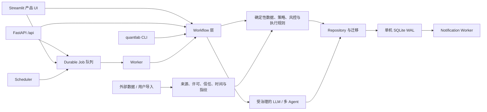

# QuantLab AI 交接与最终验收入口

> 本文是另一个 AI 接手 QuantLab 时的第一入口。它描述当前代码中的稳定结构、权限边界和验收方法，
> 但不是运行时快照。Provider 可用性、进程健康、数据覆盖、数据库行数、样本成熟度、测试数量和投资
> 结论都必须在接手时动态验证，不能从本文或历史报告推断。

## 0. 先遵守这四条

1. 仓库位于 `my-system/`；工作树可能包含用户和其他 Agent 的未提交修改，禁止 reset、覆盖或顺手清理。
2. 产品意图以 `PRODUCT_STRATEGY.md` 为准；能力是否存在以当前代码、Pydantic Schema、API 路由和测试为准。
3. 当前运行、数据、实验和样本状态只能由目标数据库、`runtime-status`、API GET 状态和匹配代码指纹的
   `data/reports/*-latest.json` 证明。
4. 不得为了“验收通过”补写历史数据、回填正式样本、重跑后冒充首次自然窗口、放宽门槛或把 Demo/Mock
   结果改名为正式证据。

权威来源按问题分工：

| 问题 | 首选依据 |
|---|---|
| 产品定位、非目标、合规边界 | `PRODUCT_STRATEGY.md` |
| 用户路径和稳定产品概念 | `PROJECT_HANDBOOK.md`、`README.md` |
| 能力是否真实存在 | `dashboard/`、`src/quantlab/`、`tests/` |
| 请求字段和客户端权限 | `src/quantlab/api/schemas.py`、`src/quantlab/api/app.py` |
| 表结构和迁移 | `src/quantlab/persistence/migrations.py` 与各 repository |
| 当前运行和数据状态 | 目标 SQLite、Runtime/API GET 状态、当前机器报告 |
| 历史原因 | `docs/BACKEND_ROUND*.md` 等历史快照，仅供追溯 |

## 1. 15 分钟阅读路线

| 时间 | 阅读内容 | 读完必须能回答 |
|---|---|---|
| 0-2 分钟 | 本文第 2、3、12 节 | 产品做什么、明确不做什么、哪些结论仍未证明 |
| 2-4 分钟 | `PRODUCT_STRATEGY.md` 的定位、非目标、产品原则和最终边界 | AI、用户和确定性规则分别拥有什么权限 |
| 4-6 分钟 | `dashboard/ui_foundation.py` 的 `PRODUCT_PAGES`；`dashboard/product_ui.py` 的 renderer 映射 | 五个一级工作区和工具页如何区分 |
| 6-8 分钟 | 本文 Golden Path；`workflows/product_demo.py`、`workflows/simulator.py` | 演示路径为何不会污染正式证据，订单何时才产生 |
| 8-10 分钟 | `domain/context.py`、`domain/data_governance.py`、`domain/trading.py` | 证据时间、研究身份、报价和交易前检查如何被约束 |
| 10-12 分钟 | `api/schemas.py`、`api/app.py`、`persistence/migrations.py` | API 信任边界、Schema 和持久化责任在哪里 |
| 12-14 分钟 | `runtime/service.py`、`runtime/worker.py`、`runtime/scheduler.py`、`runtime/readiness.py` | Runtime 四组件、Job 生命周期、正式准入为何是两层判断 |
| 14-15 分钟 | 本文动态命令与最终清单 | 如何在不伪造状态的前提下给出验收结论 |

## 2. 产品定位与非目标

QuantLab 是面向个人投资者的可审计 AI 辅助研究与模拟交易系统。它把市场发现、可复算量化证据、
多 Agent 分歧、确定性风险检查、用户确认、模拟成交和事后复盘连成一条可追溯链路。对外核心不是
“Agent 多”或“模型多”，而是：

> 看懂市场，辅助决策，模拟验证。

目标用户是希望降低研究整理成本、但仍自己做最终决定的普通投资者和有经验的个人投资者。产品首先
回答“发生了什么、为什么值得研究、反对证据是什么、操作会如何影响账户、过去判断是否兑现”。

明确非目标：

- 不是课程、考试或强制新手教学平台；
- 不以强制风险画像换取风控放宽；
- 不连接券商自动交易，不代表用户发送真实订单；
- 不保证收益，不把回测、命中率、资金流或 LLM 观点转换为盈利承诺；
- 不让 LLM 成为行情、费用、仓位、交易规则或正式证据准入的事实权威；
- 当前部署目标是单用户、单 Windows 主机、SQLite WAL，不是多租户或多主机 SaaS；
- 不为了页面好看强行产生 `buy`；空候选、`observe`、`review_required` 和 `unavailable`
  都是合法结果。

## 3. 五个一级工作区

`dashboard/ui_foundation.py::PRODUCT_PAGES` 是一级导航的代码权威：

| 工作区 | 用户问题 | 当前职责 | 不能偷偷做什么 |
|---|---|---|---|
| 今日 | 今天有什么变化、风险和待办？ | 汇总账户、持仓、论文、提醒、任务，并提供隔离 Demo 入口 | 不因打开页面自动下单或启动正式实验 |
| 市场与发现 | 哪些市场或标的值得继续研究？ | 市场状态、资金线索、搜索、自选、候选和数据可用性 | 资金流不能单独生成订单；缺数据不能合成补齐 |
| 研究台 | 支持、反对和失效条件分别是什么？ | 冻结研究、研究身份、证据引用、AI 追问、后台研究任务 | 导航上下文不能自动重跑研究或复用身份不匹配的报告 |
| 组合与交易 | 这笔模拟操作会怎样改变账户？ | 用户模拟账户、服务端报价、交易前检查、显式确认、订单、成交、盈亏 | LLM 建议不能绕过硬风控；没有用户确认不能创建订单 |
| 决策复盘 | 当时为何决策，后来发生了什么？ | 连接研究、论文、订单、费用、结果、Reflection 和任务 | 不得改写当时证据或把复盘结果回写成历史先验 |

`专业空间` 和 `帮助中心` 是工具入口，不是第六、第七个决策工作区。研究详情、专家圆桌和设置
是由工作区进入的独立 route，也不是新增一级入口。右侧全局 AI 助手是辅助入口；关闭时应回到文档流，
移动端打开时也不能覆盖核心操作。

## 4. Golden Path

### 4.1 正常产品决策链

1. 从“今日”或“市场与发现”选择标的；
2. 在“研究台”生成或打开一份带 `symbol + requested_as_of + effective_as_of + run_id` 的冻结研究；
3. 研究把行情、技术、资金、财务、事件、组合和治理信息组成有截止时间与指纹的
   `AnalysisContextPack`；
4. LLM/多 Agent 只在该上下文上输出结构化意见、反证、概率和建议区间；
5. 在“组合与交易”由服务器重新取得报价，运行费用、现金、仓位、行业集中、A 股整手、T+1、
   涨跌停和新鲜度检查；
6. 用户核对与该 check 一致的标的、方向、数量和模拟模式，显式确认后才创建幂等订单；
7. 成交、费用、持仓、净值、论文检查和 Reflection 回到“决策复盘”。

跨页面只传递受约束的 `ProductContext`。标的、研究、账户或订单身份改变时，旧的交易前检查会失效；
通知 payload 只能导航，不能确认操作或触发研究。

### 4.2 黑客松三分钟隔离路径

现场验收使用 `docs/HACKATHON_DEMO.md` 和 `scripts/start-hackathon-demo.ps1`：

1. “今日”打开“完整决策示例”；
2. 点击“生成研究与交易前检查”，读取仓库内冻结历史数据；
3. 选出冻结候选，展示 research-only 研究、多空证据与失效条件；
4. 运行真实的确定性交易前检查，但此时没有订单；
5. 用户勾选隔离声明并点击“确认隔离模拟订单”；
6. 系统在数据集指纹绑定的独立 Demo SQLite 中创建订单、模拟成交、费用和盯市；
7. 页面展示盈亏与“正式证据污染 = 0”。

这条路径验证产品闭环和工程边界，不证明独立点时有效性、实时行情、Provider 在线、正式样本成熟或
策略 Alpha。Demo 固定为 `research_only=true`、`training_eligible=false`、
`forward_scorecard_eligible=false`，重置只作用于该指纹对应的隔离账本。

## 5. 架构与数据流

必须知道的实现事实：

- Streamlit 的正常产品模式在同一 Python 进程中直接调用 workflow/repository，不是 FastAPI 的前端客户端；
- FastAPI、CLI 和 Streamlit 是并列入口，业务规则应收敛在 domain/workflow/execution，而不是各入口复制；
- Pydantic domain model 和 API request schema 负责输入形状与不变量，repository 负责 SQLite 事务和审计记录；
- 耗时、可重试或需要恢复的动作进入 `background_jobs`，Worker 调用同一 workflow；
- Scheduler 只提交幂等 Job 图，不应在 scheduler tick 内直接完成业务副作用；
- 外部数据先获得 provenance、namespace、trust、`available_at` 和 fingerprint，才能进入上下文或正式准入；
- UI 的短期 readiness 缓存只优化页面重跑，不能供 Worker、Scheduler、实验或订单准入使用。
