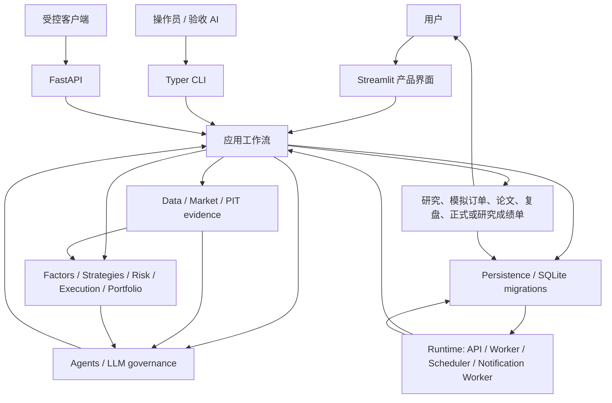
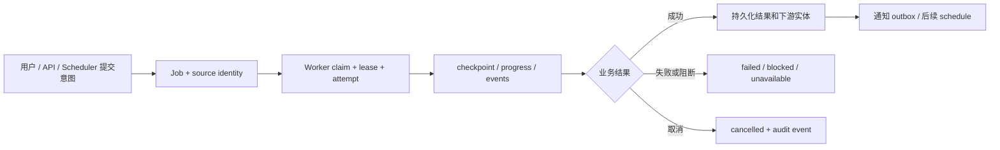
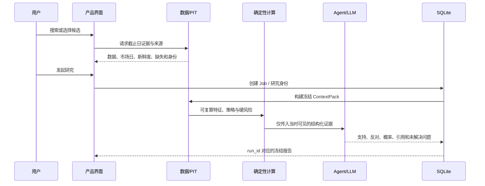
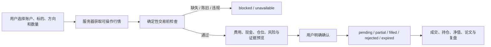

# 当前架构与数据流

本文描述 QuantLab 当前稳定的边界和调用方向，不写死路由数、表数、迁移版本、Provider 状态或
实验样本数。组件是否存在以当前代码、迁移注册表、API Schema 和测试为准；运行事实以目标数据库、
Runtime 和匹配指纹的机器报告为准。

## 架构原则

QuantLab 把事实、建议、权限和证据拆开，避免一个 LLM Prompt 同时承担所有职责：

1. 数据与证据层决定系统在某个截止时间实际知道什么；
2. 确定性策略、执行和风控层计算指标、费用、仓位与硬约束；
3. LLM 与多 Agent 层负责解释、反证、概率和研究草稿；
4. 用户决定是否确认模拟操作或登记外部成交；
5. Runtime 和持久化层保存任务、身份、审计、到期结果与恢复过程。

LLM 不能伪造事实、修改历史快照、放宽硬风控、自动确认订单，或把研究/Demo 结果提升为正式证据。

## 系统分层



### 交互层

- `dashboard/app.py`：Streamlit 入口，以及从专业空间进入的工程审计界面；
- `dashboard/product_ui.py`：五个一级决策工作区、工具入口和二级路由；
- `dashboard/ui_foundation.py`：导航、响应式布局与原子页面上下文；
- `src/quantlab/cli.py`：运维、研究、验收和批处理命令；
- `src/quantlab/api/`：FastAPI 路由与公共请求/响应 Schema。

界面只提交用户意图。价格、费用、订单状态、仓位、权限和证据准入仍由服务器侧领域代码决定。

### 应用工作流层

`src/quantlab/workflows/` 编排研究、市场发现、ContextPack、Chat、圆桌、模拟交易、投资论文、
Reflection、通知、前瞻实验和宽样本研究。工作流决定调用顺序和失败传播，但不能偷偷改变金融规则。

耗时或可重试操作应提交到 Job/Worker。同步页面读取不应顺带启动正式实验、补写样本或执行 Scheduler。

### 数据与市场层

- `src/quantlab/data/`：Provider、适配、缓存、质量、来源和 fallback；
- `src/quantlab/market/`：交易日历、行情语义和执行报价；
- `src/quantlab/domain/data_governance.py`：数据可信等级和 namespace 约束；
- 点时池、manifest、selection 和字段时间共同定义一次可审计的数据身份。

免费 Provider 没有 SLA。fallback 必须记录实际选择、市场日期、缺失字段和降级原因，不能把不同语义
的数据静默拼接，也不能用最近成功数据冒充当日成功。

### 确定性金融层

- `src/quantlab/factors/`、`strategies/`：可复算因子和策略候选；
- `src/quantlab/backtest/`：历史回测、时间切分、费用与统计；
- `src/quantlab/risk/`：数据、标的、组合和永久损失硬约束；
- `src/quantlab/execution/`：A 股整手、T+1、涨跌停、费用、滑点和订单规则；
- `src/quantlab/portfolio/`：预算、集中度、现金、平滑调仓与策略准入。

策略输出候选、分数或目标权重，不直接拥有成交权限。历史研究通过也不自动获得正式组合预算。

### LLM 与多 Agent 层

- `src/quantlab/agents/`：角色、委员会、圆桌、决策政策与结构化 Schema；
- `src/quantlab/llm/`：Provider、能力路由、调用审计、预算和治理；
- `PROMPT_GOVERNANCE.md`：结构化输出、敏感信息、降级与拒绝规则。

系统支持可配置的 DeepSeek、OpenAI 官方端点、用户确认的 OpenAI-compatible 端点和 Mock Provider。
“配置存在”“探针成功”“某次调用成功”和“模型提高投资收益”是四个不同结论。

### 持久化层

QuantLab 使用本机 SQLite 作为单机权威状态。`src/quantlab/persistence/migrations.py` 维护有序、带校验
和的组件迁移；当前组件覆盖决策学习、模拟账户、Chat、通知、证据、策略证据、Job、后续领域扩展和
宽样本研究。迁移版本号不得从本文推断，应读取代码和目标数据库的 registry。

重要仓储包括：

- 用户模拟账户、订单、成交、持仓、净值与复盘；
- Chat、动作草稿、确认和会话上下文；
- Job、事件、attempt、lease、结果与取消；
- 投资论文、revision、检查、Reflection 与 Decision Run；
- 数据 manifest、PIT 池、Provider selection 和 readiness；
- 正式前瞻、影子账户、宽样本研究和相互隔离的成绩单。

迁移使用临时副本验证后发布。生产升级前仍需在线备份、checksum、integrity/foreign-key 检查和恢复
dry-run；不能依赖旧 API 进程隐式升级活跃数据库。

### Runtime 层

`src/quantlab/runtime/` 包含单机进程主管、Worker、Scheduler、通知投递、readiness、Soak、备份和
Windows 自启动支持。稳定部署形态是同一主机上的 API、一个或多个 Worker、Scheduler、通知 Worker
与本地 SQLite WAL。



Job `completed` 只证明 Worker 正常返回；还要检查 result payload、attempt、来源、指纹、下游实体和
业务特定的 readiness。Scheduler tick 必须幂等，显式 backfill 不能补造 Primary 正式样本。

## 核心业务数据流

### 市场发现到冻结研究



研究身份至少需要标的、请求日期、有效数据日和 `run_id`；上下文不匹配时旧报告不能自动复用。

### 研究到用户确认的模拟订单



任何账户、标的、方向、数量、行情或研究身份变化都会使旧检查失效。AI 只能生成草稿，不能代替用户
确认；已成交订单不能被前端伪装为撤销。

### 正式数据与自然前瞻

```text
server-controlled source
  -> Provider selection + trusted manifest
  -> production calendar / industry / exact-day PIT pool
  -> readiness（质量指纹、字段、时间、进程、LLM 等）
  -> 真实交易日的自然 Scheduler provenance
  -> frozen primary cohort / variants / isolated shadow accounts
  -> 5/20 交易日自然到期
  -> 含成本成绩单、基准、区间和消融
```

恢复链可以留下有效的恢复证据，但不能改写为首次自然窗口成功。`available_at` 晚于 cutoff 的字段不能
进入该快照，后续补齐的数据也不能回填原样本。

## 身份与账户隔离

| 空间 | 用途 | 是否可进入正式成绩 |
|---|---|---|
| 用户模拟账户 | 用户自由买卖和产品体验 | 否 |
| Historical Demo | 冻结数据上的隔离演示 | 否，固定 `research_only/test_only` |
| 系统影子账户 | 冻结变体的自然前瞻执行 | 仅进入绑定协议的影子成绩 |
| 外部真实组合 | 用户手工/CSV 维护的只读账本 | 否，不冒充券商连接 |
| Primary 正式前瞻 | 预注册协议的自然样本 | 满足全部 provenance 与 PIT 门槛后才可 |
| 宽样本研究 | 独立协议的横截面研究 | 与 Primary、用户模拟和训练隔离 |

产品使用事件、用户采纳、Demo、恢复测试和人工导入不得污染正式训练或 forward scorecard。

## 配置与安全

- `config/default.toml` 保存无密钥默认配置；本机覆盖和 `.env` 保存用户选择与秘密；
- API Key 不得进入 TOML、数据库业务 payload、报告、截图或命令行参数；
- 自定义兼容端点必须由用户明确配置，不能把官方 Key 静默发送到第三方；
- API 若未配置令牌，只应绑定回环地址；公网、多租户和券商自动交易不在当前范围；
- 导出和日志需要脱敏，但脱敏报告不等于可以公开再分发第三方数据。

## 阅读代码的最短路径

1. `dashboard/ui_foundation.py` 和 `dashboard/product_ui.py`：产品导航与用户流程；
2. `src/quantlab/workflows/product.py`、`research_identity.py`、`simulator.py`：产品编排；
3. `src/quantlab/domain/`：Context、Job、研究、论文和交易对象；
4. `src/quantlab/runtime/`：Scheduler、Worker、readiness 与运行主管；
5. `src/quantlab/persistence/migrations.py` 及相关仓储：Schema 与事务边界；
6. `src/quantlab/agents/`、`src/quantlab/llm/`：模型权限与路由；
7. `src/quantlab/api/app.py`、`src/quantlab/cli.py`：外部入口；
8. 对应 `tests/`：正常路径、失败路径和信任边界。

第一版决策形成过程保留在根目录 `ARCHITECTURE.md`；Round 演进保留在 `docs/BACKEND_ROUND*.md`。
它们用于追溯，不覆盖本文和当前实现。
