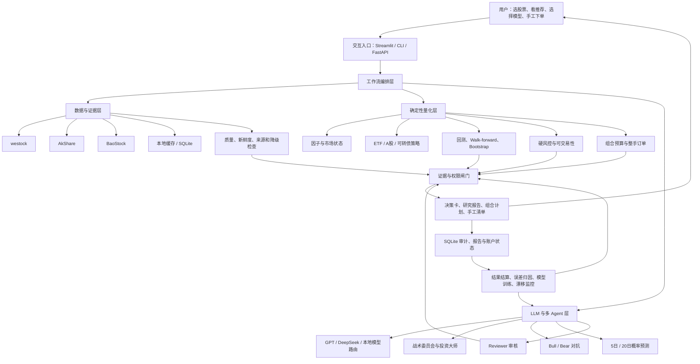
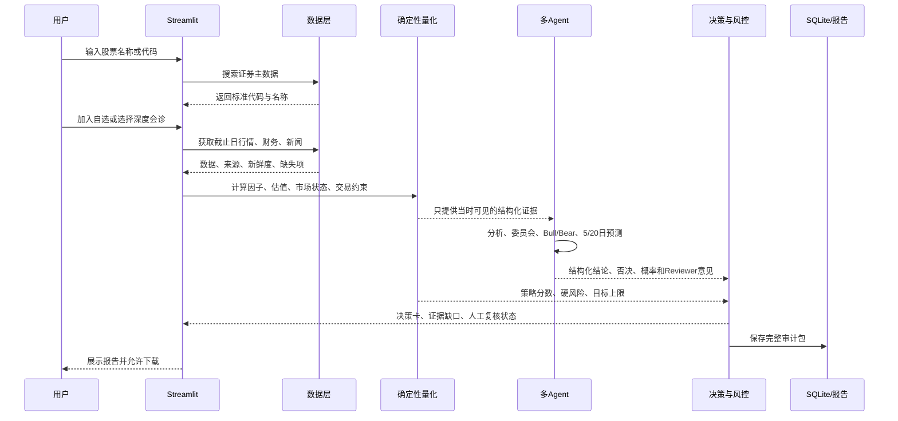
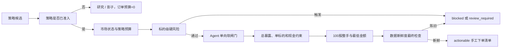
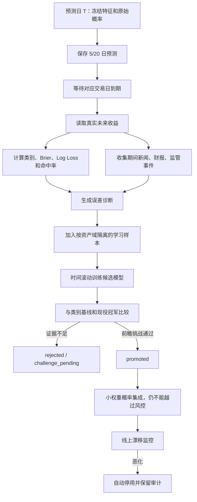
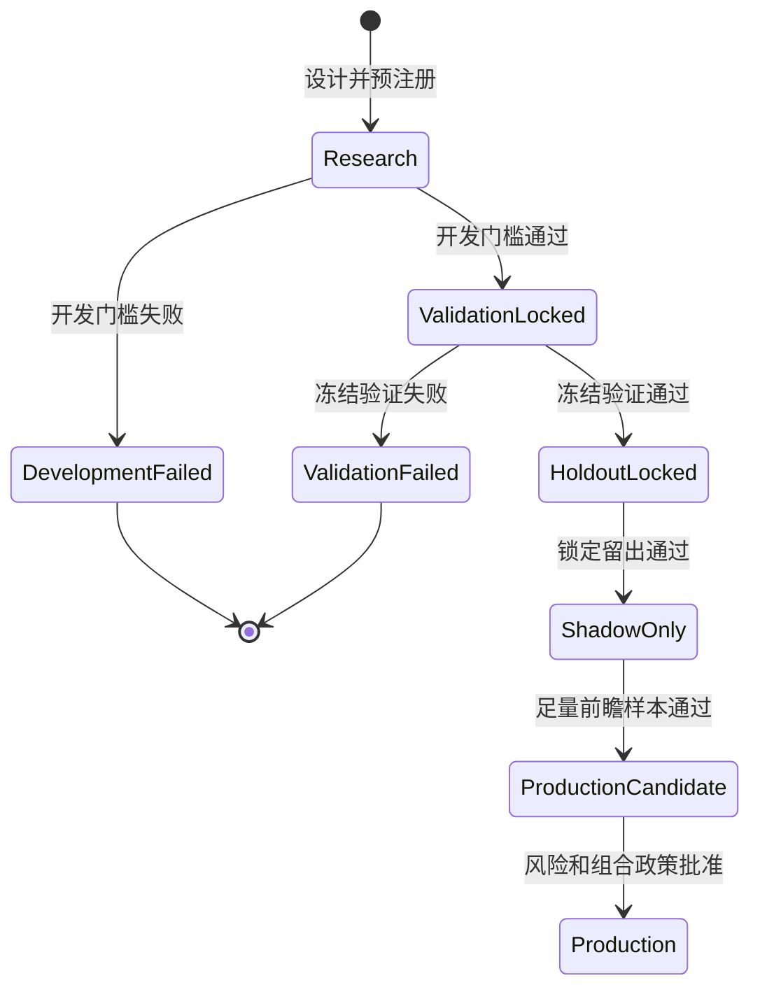

# 整体架构与数据流

## 1. 架构的核心原则

QuantLab 不是把所有逻辑塞进一个大模型 Prompt，而是把系统拆成四个权力不同的平面：

1. **数据与证据平面**：决定系统实际知道什么；
2. **确定性量化与风控平面**：计算指标、策略、成本、仓位和硬约束；
3. **LLM 研究与探索平面**：解释、反驳、发现问题和输出概率软信号；
4. **人工执行与学习平面**：用户确认订单，未来结果回填并评估模型。

最关键的权限原则是：

> LLM 可以解释、质疑、否决或让系统更保守，但不能绕过确定性风险规则，也不能擅自放大仓位。

## 2. 总体架构图

## 3. 每一层做什么

### 3.1 交互入口

系统有三种入口：

- Streamlit：给普通用户使用的图形前端；
- Typer CLI：给开发、回测、批处理和验收使用；
- FastAPI：给未来 Web、插件、Agent Gateway 或其他程序调用。

三种入口尽量复用同一批工作流，不应该各自实现一套金融逻辑。

### 3.2 工作流编排层

工作流层负责把多个步骤串起来，例如：

- 获取行情；
- 计算因子；
- 调用多 Agent；
- 运行概率预测；
- 经过 Reviewer；
- 生成组合计划；
- 保存数据库和报告。

主要代码位于 `src/quantlab/workflows/`。

工作流层本身不应偷偷改变金融规则。它负责“按什么顺序调用”，而策略、成本和风险规则由更底层模块决定。

### 3.3 数据与证据层

数据层包含：

- westock 适配器；
- AkShare 行情、财务、行业和新闻接口；
- BaoStock A 股证券主数据和历史状态；
- Parquet/本地缓存；
- SQLite 元数据、研究、模拟盘和审计记录；
- 数据源 fallback；
- 新鲜度、完整性和价格语义检查。

#### 为什么有多个数据源

免费数据源不稳定，可能超时、字段改变或缺少某只证券。系统会按优先级尝试备用源，但不能把不同语义的数据悄悄拼接。

例如：

- 成交必须用原始价格；
- 技术指标可以用后复权价格；
- 备用源如果无法提供同样的价格语义，就不能直接补上。

#### 显式降级

如果首选数据源失败，系统会记录：

- 实际使用了哪个来源；
- 哪些标的缺失；
- 数据是否陈旧；
- 是否允许继续研究；
- 是否禁止生成订单。

### 3.4 因子与市场状态

因子引擎负责计算确定性数值，例如：

- 20/60 日动量；
- 动量加速度；
- 路径质量；
- 量价非对称；
- 收益偏度；
- RSI；
- 均线乖离；
- 日、周、月趋势共识；
- 回撤反转条件。

市场状态模块将市场粗分为趋势、震荡、风险关闭或高波动等状态，用于调整研究上下文和风险预算。

这些数字由 Python 计算，不交给 LLM 心算。

### 3.5 策略层

策略层目前有：

- ETF 主动轮动；
- 冻结六 ETF 等权核心；
- Adaptive ETF V1/V2/V3 研究候选；
- A 股反转和市场状态策略 V1/V2/V3；
- 可转债双低。

策略输出候选、分数或目标权重，不直接拥有下单权限。

### 3.6 回测与证据层

回测引擎负责：

- T 日收盘形成信号；
- T+1 开盘成交；
- 股票 T+1 可卖规则；
- 停牌和涨跌停；
- 100 股整手；
- 佣金、最低佣金、印花税、过户费和滑点；
- 连续资金曲线；
- 基准对照；
- Walk-forward；
- 参数敏感性；
- Bootstrap 统计。

策略验证和预测模型验证是两套不同系统：

- 策略验证看收益、Sharpe、回撤、成本和基准；
- 预测模型验证看 Brier、Log Loss、校准和前瞻挑战。

一个概率模型更准，不能直接冒充策略收益已通过。

### 3.7 多 Agent 与 LLM 层

这一层负责处理难以仅靠固定公式完成的问题：

- 基本面解释；
- 新闻风险；
- 技术与动量证据的语言总结；
- Buffett、Munger 等长期投资视角；
- Bull/Bear 相互反驳；
- 未来 5/20 日概率预测；
- Reviewer 检查文本和决策是否冲突；
- 专家圆桌。

LLM 层使用结构化 Schema 输出，不接受一段无法稳定解析的随意文章作为内部数据契约。

### 3.8 风控与组合层

风险层处理：

- 总暴露上限；
- 单标的上限；
- 行业集中度；
- 现金储备；
- 数据新鲜度；
- ST、退市、停牌、涨跌停；
- 质押、解禁、诉讼和监管风险；
- 财务永久损失风险；
- 可转债评级、规模和强赎风险。

组合规划器再把目标权重转换成可执行整手，并处理：

- 买不起一手；
- 最低交易金额；
- 卖单优先；
- 退出历史目标；
- 现金不足；
- 研究策略零预算。

### 3.9 持久化与审计

SQLite 保存的对象包括：

- 决策与 Agent 报告；
- LLM 调用审计；
- 预测和真实结果；
- 模型版本与挑战状态；
- 策略验证；
- 历史盲测；
- A 股股票池快照；
- 自选池；
- 信号和预警；
- 手工交易账本；
- 组合计划；
- ETF/A 股模拟盘；
- 专家圆桌。

Markdown 和 JSON 报告用于给人阅读和给其他 AI 审查。导出时会递归删除敏感字段，并扫描 Key、Bearer、Secret 等文本。

## 4. 用户自选股票后的完整数据流

如果该股票要进入组合，还必须再经过策略准入和组合预算。深度会诊得到“看多”，并不自动获得买入预算。

## 5. 系统推荐股票的数据流

系统推荐分成便宜和昂贵两层：

1. **快速发现层，不调用 LLM**
   - 从股票池或点时市场样本获取行情和财务快照；
   - 分别按趋势质量、价值质量、成长质量、回撤修复和高股息发现候选；
   - 统一重排并做相关性去重；
   - 输出“优先研究候选”。

2. **深度会诊层，调用 LLM**
   - 只有用户明确选中的最多 5 只股票进入；
   - 逐只运行财务双源验证、战术委员会、投资大师、Bull/Bear、预测和 Reviewer；
   - 保存报告和调用审计。

这样可以避免全市场每只股票都调用昂贵 LLM，也避免把快速分数误当成买入建议。

## 6. 从研究到手工订单的数据流

Agent 单向软闸门意味着：

- Agent 可以把买入变成观望、减仓或复核；
- Agent 可以限制策略目标上限；
- Agent 不能把未准入策略变成可执行；
- Agent 不能突破总暴露和单标的上限。

## 7. 学习闭环数据流

这个闭环不是让大模型自己修改代码，而是训练一个透明的概率模型，并严格控制它何时能影响系统。

## 8. 策略准入状态流

历史测试通过通常也只允许进入影子账户，不自动等于真钱生产。

## 9. 配置如何控制系统

主要配置在 `config/default.toml`，包括：

- 初始资金：100,000 元；
- 总暴露上限：80%；
- 单标的上限：15%；
- 行业上限：30%；
- 现金储备：20%；
- 默认四分之一凯利；
- 最大组合回撤限制：15%；
- 股票和 ETF 各自的费用与滑点；
- Walk-forward 训练/测试长度；
- LLM Provider、角色模型和推理强度；
- ETF、A 股和可转债策略参数。

配置是默认值，不代表所有策略都拥有使用这些上限的资格。证据门槛可以把实际预算降为 0。

## 10. 架构边界

当前架构仍有这些平台级缺口：

- 长任务多为同步执行，尚未统一成后台 job + 进度 + 取消；
- 免费数据源没有服务等级保证；
- 行业资金流、北向、宏观数据仍不完整；
- 没有操作系统级通用任务平台，只有脚本和安装计划任务入口；
- 没有自动盯市真实持仓；
- 没有通知中心和受限工具型自由 Chat；
- 没有券商连接，这是当前有意保留的产品边界。
